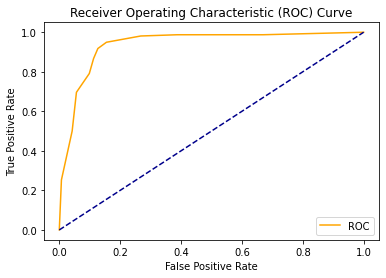

<h1 dir = 'rtl'> نمودارهای ROC</h1>

اول از همه، دو تا نرخ مهم داریم :  
TPR: یعنی تعداد مثبت هایی که درست تشخیص دادیم به کل مثبت ها. یعنی از کل مثبت ها چقدرشون رو مثبت پیش بینی کردیم. 
FPR: یعنی تشخیص های مثبت اشتباه نسبت به همه منفی ها. یعنی از کل منفی ها چقدرشون رو به اشتباه مثبت تشخیص دادیم. 
این نمودار برای انتخاب بهترین حد آستانه در مسائل کلاس بندی هست. یعنی اول میایم مدل رو بر اساس داده های آموزشی درست میکنیم، بعد میایم احتمال داده های تست برای هر کلاس رو بدست میاریم. بعد میایم به ازای حد آستانه های مختلف برای این احتمالات، نمودار میکشیم.

شکل بالا میگه اون خط آبی انگار چیزی نمیده و بصورت رندم داده رو لیبل میزنه، یعنی به احتمال 0.5 درست تشخیص بده. 
AUC یعنی مساحت زیر منحنی، هر چقدر زیاد باشه یعنی مدل میتونه خوب پیش بینی کنه. 
علاوه بر این نمودار، یه نمودار بر حسب Precision/Recall هم داریم. نمودار ROC برای داده های بالانس و این یکی نمودار برای داده های نابالانس هست. 
AUC هم یعنی مساحت زیر نمودار، هر چقدر بیشتر بشه، یعنی اینکه مدل به حالت ایده آل نزدیکتره.
 
به fp خطای نوع یک و به fn خطای نوع دو میگن!

<pre><code>
Recall = TP / (TP + FN)
Precision = TP / (TP + FP)
F-Score = (2 * Recall * Precision) / (Recall + Precision)
</code></pre>

Precision: یعنی از کل مثبت هایی که تشخیص داده، چقدرشون واقعا مثبته و درست تشخیص داده شده؟ 
Recall: یعنی مدل چقدر تونسته مثبت ها رو شناسایی کنه

[notebook](https://github.com/MahdiEsrafili/MahdiEsrafili.github.io/blob/master/ROC_AUC/ROC_AUC.ipynb)

