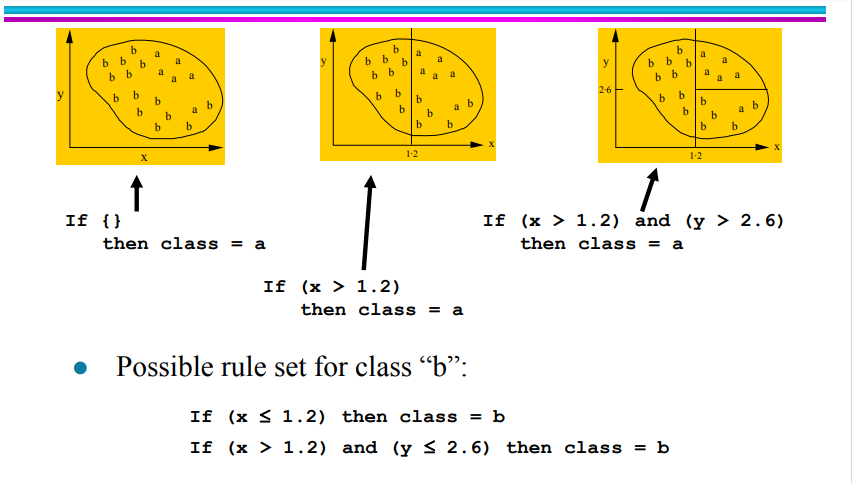

<h1 dir ='rtl'> Rule Based Classification</h1>

این کلاس بندها همانطور که از اسمشون پیداست بر اساس یه سری if then ها عمل میکنن. 
البته این کلاس بند ایرادایی هم داره از جمله این که شاید شرط ها تداخل داشته باشند یا حتی بدتر، دو تا شرط، یک نمونه داده رو در دو کلاس متفاوت کلاس بندی کنن! برای حل این مشکل میشه اولویت به بعضی شرط ها داد، یا حالت نظرسنجی گذاشت. یه مشکل دیگه هم اینه که شاید شرط ها، همه داده ها رو پوشش ندن و بعضی داده ها بی صاحب بمونن!!
 
روش های مختلفی برای ایجاد شرط ها وجود داره، از جمله اینکه از روی درخت تصمیم این قوانین رو استخراج کنیم. یه روش هم Sequential Covering هست. روش به این صورته: 
- در هر مرحله rule رو برای یک کلاس ایجاد میکنیم. 
- با یه طریقی (که در ادامه میگم) یه قانون درست میکنیم
 
- هر داده ای که با این rule  دسته بندی شد، از مجموعه داده ها حذف میشه. 
حالا چطوری rule درست کنیم؟ 
- با یه قانون کلی شروع میکنیم، یعنی میگیم همه داده ها مربوطه به کلاسی هستن که ما داریم براش قانون می ذاریم.! 
- حالا یه ویژگی انتخاب میکنیم و با اون قانون می ذاریم. 
- این کارو تا وقتی ادامه میدیم که دیگه داده ای نمونه یا یه شرایط دیگه اتفاق بیفته که بعدا مینویسم . شکل پایینی خوبه:

[منبع خوب](imgs/rule_based/rule_based.pdf)
ادامه دارد....
