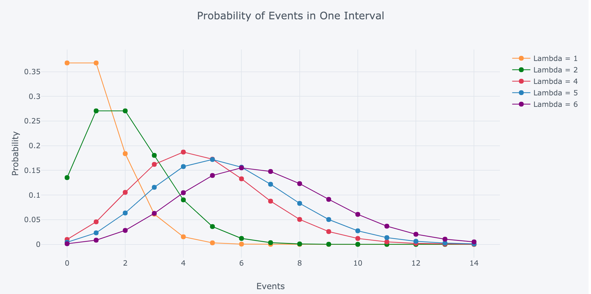
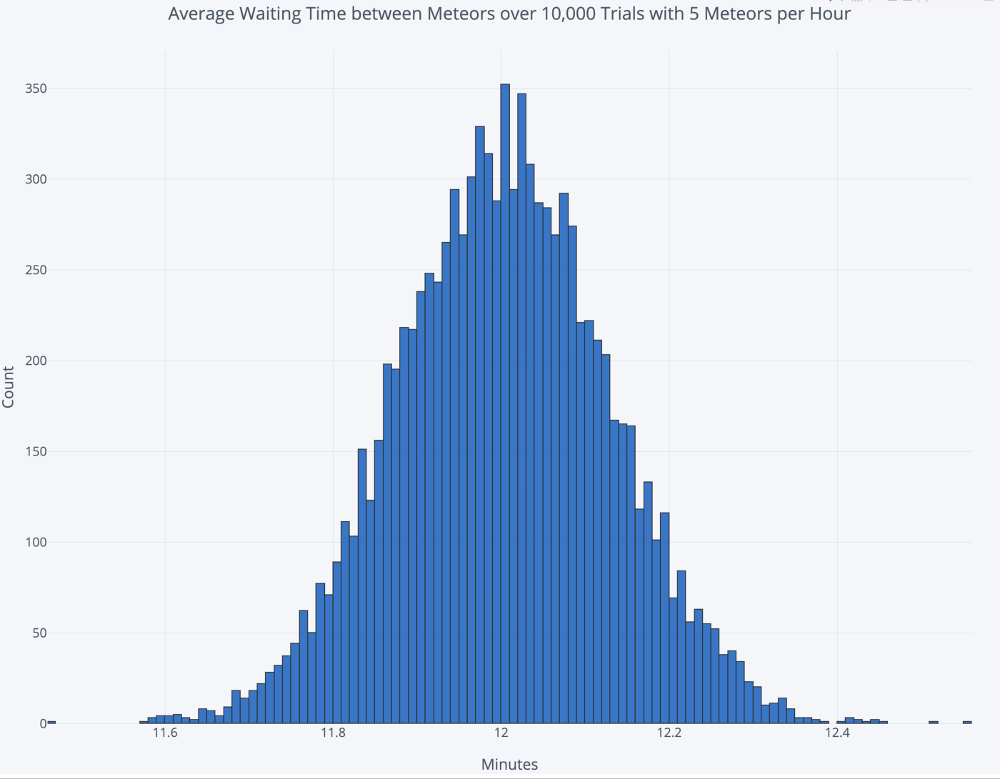

<h1 dir = 'rtl'> احتمالات </h1>
<h2 dir = 'rtl'>استقلال پیش آمد ها </h2>

 
دو پیشامد A, B از هم مستقل هستند اگر :
 

P(A∩B) = P(A)P(B)
 
مثلا:

<pre><code>
A={HT,HH} , B={HT,TH}  
P(A)=P(B) = 1/4 + 1/4 = 1/2  
P(A∩B) = P({HT}) = 1/4  
P(A)*P(B) = 1/2 * 1/2 = 1/4  
</code></pre>
<h2 dir='rtl'> امید ریاضی</h2>

یعنی اینکه میانگین چیزی که میبینیم چیه. مثلا بعد از انداختن تاس به تعداد زیاد، میانگین عددی که میبینیم چنده؟ 

<pre><code>
E(X) = ∑xP(X=x) 
</code></pre>

مثلا برای تاس ها:

<pre><code>
E(X) = 1*1/6 + 2*1/6 + 3*1/6 4*1/6 +5*1/6 + 6*1/6 = 3.5
</code></pre>

این به این معنیه که میانگین عددی که بعد از کلی تاس انداختن میبینیم اینه. 
در مسائلی که مقدار پیشامدها عددی نبود(مثل شیر یا خط) ، اونها رو به عدد تبدیل میکنیم.

<h3 dir = 'rtl'> رابطه امید ریاضی و واریانس</h3>

واریانس یعنی تفاوت مقدار یک متغیر تصادفی از میانگین یا امید ریاضی اون متغیر: 

<pre><code>
X - E(X)
</code></pre>

ولی خود همین یه عدد تصادفیه (چون X  تصادفیه) . پس از همین یه امید ریاضی یا میانگین بگیریم:

<pre><code>
Var(X) = E(X - E(X))
</code></pre>

ولی چون میخوایم واریانس یه عدد مثبت باشه، مقدار داخل امید ریاضی رو به توان دو میرسونیم

<pre><code>
Var(X) = E((X - E(X))^2)
important:
Var(cX) = c^2Var(X)
Var(X) = E(X^2) - E(X)^2
X , Y independent ⇒ Var(X+Y) = Var(X) + Var(Y)
</code></pre>
<h3 dir = 'rtl'> نامساوی های مهم</h3>
<pre><code>
Markov:
P(X>=a) <= E(X)/a
Chebyschev :
P(|X-EX|>ϵ) <= Var(X)/ ϵ^2
</code></pre>

<h2 dir = 'rtl'> قوانین دمورگان در مجموعه ها </h2>
 

فرض کنیم A , B دو مجموعه در فضای نمونه ها باشند:
 

 <pre><code>
 (A ∪ B)ᶜ = Aᶜ ∩ Bᶜ 
 (A ∩ B)ᶜ = Aᶜ ∪ Bᶜ 
  </code></pre>

<h2 dir ='rtl'> احتمالات شرطی</h2>

<pre><code>
P(A|B) = P(A ∩ B) / P(B)
P(A|B) = P(B|A)*P(A)/P(B)
</code></pre>

<h2 dir ='rtl'> توابع توزیع احتمال </h2>

 
برای اینکه fx  تابع چگالی احتمال درستی باشد: 
 

 <pre><code>
 ∫f(x)dx = 1
 CDF: F(x) = ∫f(u)du
 </code></pre>
 <h3 dir= 'rtl'> توزیع نرمال</h3>
 <pre><code>
 X ∼ N(μ, σ² )
 pdf :  f(X) = (e^-((x-μ)² ÷ σ²)) / √ (2πσ²) 
 </code></pre>
 

نکات مهم : 
1- اگه X ,Y هر دو توزیع نرمال مستقل از هم باشند، مجموع این دو نیز توزیع نرمال با میانگین مجموع و واریانس مجموع می باشد 
2- ضرب عدد ثابت ، میانگین را با همان نسبت و واریانس را با توان دو زیاد می کند. 
3- جمع یک عدد ثابت نیز فقط میانگین را همان مقدار زیاد می کند.
 

 <h3 dir = 'rtl'>
 قضیه حد مرکزی
  </h3>

فرض کنید مجموعه داده ای با میانگین μ  و واریانس  σ²  موجود است. اگر ما از این مجموعه داده N بار نمونه برداری کنیم و میانگین نمونه ها را حساب کنیم، به یک توزیع نرمال با میانگین μ  و واریانس σ²÷N میرسیم. در واقع مهم نیست که توزیع اصلی داده های چی باشه، نرمال باشه یا یکنواخت یا منحرف شده، در نهایت توزیع میانگین نرمال خواهد بود.

<h2 dir = 'rtl'>
آزمون های آماری Hypothesis Testing
</h2>
<h3 dir ='rtl'> تست مقدار پی  (p-value test) </h3>

در این تست دو تا فرضیه داریم. یکی فرضیه null یا همون H0 که همون اطلاعات قبلیه و چیز جدید بهمون نمیگه. یکی هم فرضیه جایگزین یا آلترناتیو. نحوه تست اینطوری:
 
1-فرضیه صفر و آلترناتیو رو مشخص میکنیم 
2-مقدار آلفا یا اهمیت رو انتخاب می کنیم 
3-فرض میکنیم اگر فرض صفر درست بود، چقدر احتمال داره که تست جدید امکان پذیر باشه. این مقدار احتمال، همون p-value هست. 
4-مقدار z رو از جدول یا فرمول بدست می آوریم. 
5-اگه مقدار احتمال کمتر از آلفا بود، میگیم که فرض صفر غلطه؛ چون اگه فرض صفر درست بود، نباید میانگین تست جدید در اون بازه می بود. 
 
این تست یکی از کاربردهای قضیه حد مرکزیه. چون میاد یکی از پارامتر ها که اغلب میانگین هست رو در یه توزیع نرمال بررسی میکنه، که این توزیع احتمال خودش از قضیه حد مرکزی استخراج میشه.

[یه فیلم خوب برای توضیحش](https://www.youtube.com/watch?v=-FtlH4svqx4) 

در واقع اساسش بر اینه که میانگین آزمون جدید چقدر از میانگین فرضیه نال دوره. میدونیم که در توزیع نرمال 68درصد داده ها در فاصله یک واریانس از میانگین، 95 درصد داده ها در فاصله 2 واریانس و 99.7درصد داده ها در فاصله 3 واریانس از میانگین قرار دارد.  
میاین با تبدیل z  میسنجیم که میانگین آزمون جدید، چند تا واریانس از میانگین فرض صفر دوره، وقتی اینو بدست آوردیم، میفهمیم که چقدر احتمال داره میانگین جدید در اون فاصله از میانگین اعلام شده قرار داشته باشه. مثلا میفهمیم میانگین جدید به اندازه 3 تا واریانس از میانگین فرض صفر قرار داره، از اون طرف میدونیم 99.7 درصد داده ها در فاصله 3 واریانس از میانگین هستن، پس 0.3 درصد احتمال داره که داده ای، خارج از فاصله 3 واریانس باشه و این 0.3 درصد هم تقسیم میشه (چون توزیع نرمال نسبت به میانگین تقارن داره و نصف میفته پایین تر از میانگین و نصف میفته بالاتر از میانگین).
 
پس با توضیحات بالا فهمیدیم این احتمال p یا همون p-value برابر 0.003 هست
 
حالا اگه آلفا مون 0.05 باشه، میبینیم که این p-value کمتر از آلفا هست، یعنی کمتر از اون مقدار با اهمیت ما، پس:
 
"احتمال نداره که با درست دونستن فرض صفر، میانگین داده های آزمون جدید این مقدار بدست بیاد، پس فرض صفر رده و احتمالا فرض آلترناتیو درست باشه. " 
البته نمیشه هم گفت که فرض آلترناتیو درسته، ما فقط فرض صفر رو به نفع فرض آلترناتیو رد میکنیم.

<pre><code>
centeral limit:
μ = μⁿ 
σⁿ = σ ÷ √n
n = size of test
z transform : z = (μⁿ - μ) ÷ σ 
</code></pre>

پس اینطوری شد که اول میاین با تبدیل z، میزان فاصله میانگین جدید از میانگین اظهار شده رو نسبت به واریانس میسنجیم، سپس با این عدد میایم از روی جدول z میبینیم چند درصد داده ها داخل و خارج از این فاصله هستن و این احتمال رو با آلفا مقایسه میکنیم و اگر کمتر بود، فرض نال رو رد میکنیم.

<h2 dir = 'rtl'> درست نمایی  Lilkelihood</h2>

این مفهوم خیلی شبیه به همون بحث احتمالات هست. معنیش هم درست نمایی یا راست نماییه. مثلا فرض کن یه سکه داریم نمیدونیم بایاسش به سمت H ها چقدره.اونو 4 بار میندازیم و این نتیجه بدست میاد: HHTH 
حالا میگیم چقدر احتمال داره (درسته) که b=0.1 باشه و این نتیجه بدست بیاد؟

<pre><code>
L(b;X) = P(X|b=0.1) = (0.1)³ * (0.9)* C(4,3) = 4*9e⁻⁴ 
</code></pre>

معنیش هم اینه که اگه بدونیم X اتفاق افتاده باشه، چقدر درسته که b رو فلان مقدار بگیریم؟ 
در واقع ما از درست نمایی توی بیشینه درست نمایی استفاده میکنیم تا پارامترهای یک مدل رو بدست بیاریم.یعنی چی؟ یعنی یه سری داده بهمون دادن و میگن اینو مدل کن.مثلا توزیع نرمال داره، ما با بیشینه درست نمایی پیدا میکنیم که چه میانگین و انحراف معیاری موجب میشه این توزیع  داده رو داشته باشیم. 
پس هر وفت خواستیم درست نمایی یا همون likelihood یه سری پارامترها رو بدست بیاریم، میایم احتمال مشاهده هر داده با اون پارامترها رو پیدا میکنیم و در هم ضرب میکنیم:

<pre><code>
L(b,X) = p(X=x₁|b)*p(X=x₂|b)* ... p(X=xₙ)
</code></pre>
<h3 dir = 'rtl'> تخمین بیشترین درست نمایی Maximum Likelihood Estimation</h3>

منظور اینه که میخوایم بهترین پارامترها برای توزیع رو بدست بیاریم، میایم درست نمایی به ازای هر پارامتر رو بدست میاریم و بیشترین اون رو به عنوان بهترین پارامترو مدل درس نظر میگیرم:
  
 در واقع میایم در تابع درست نمایی، نسبت به اون پارامتر مشتق میگیرم و برابر صفر قرار میدیم؛ همچنین مشتق دوم هم باید نامنفی باشه. البته چون محاسبه این دشوار میشه و خود این عدد خیلی کوچیک میشه، بجای likelihood از لگاریتمش یا همون logLikelihood استفاده میکنیم.
 

 <pre><code>
 L(b;X) = p(X=x₁|b)*p(X=x₂|b)* ... p(X=xₙ)
 log(L(b;X)) = log(p(X=x₁|b)*p(X=x₂|b)* ... p(X=xₙ)) ⇒ 
 LL(b;X) = log(p(X=x₁|b)) + log(p(X=x₂|b)) + ... + log(p(X=xₙ))
 dLL(b;X)/db = dlog(p(X=x₁|b))/db + dlog(p(X=x₂|b))/db + ... + log(p(X=xₙ))/db
  </code></pre>

 

علامت likelihood هم چیز خوبی میگه: بر اساس مشاهده ای که داشتیم و داده ای که جمع آوری کردیم، چقدر درسته که پارامترها رو فلان مقدار قرار بدیم؟ چقدر احتمال داره که داده رو این مدلی ببینیم؟
 

 <h2 dir = 'rtl'> بعضی توزیع های مهم </h2>
 <h3 dir ='rtl'> توزیع دو جمله ای  Binomial</h3>
 

 اولا یه توزیع گسسته س، یعنی خروجی فقط دو تا مقدار می تونه داشته باشه: موفقیت یا شکست. مثل انداختن شیر یا خط. اگه احتمال موفقیت رو p در نظر بگیریم، احتمال شکست میشه 1-p . اگر این آزمایش رو n بار انجام بدیم، احتمال x بار موفقیت میشه:
 

 <pre><code>
 p(x) = (n! ÷ (x!*(n-x)!) * pˣ*(1-p)ⁿ⁻ˣ 
 μ = n*p
 σ = √(n*p*(1-p))
 </code></pre>
 <h3 dir = 'rtl'> توزیع پوآسن Poisson</h3>
 

این توزیع مربوط به احتمال مشاهده k ایونت در زمان می باشد. مثلا میدانیم در یک خیابان در هر ساعت میانگین 10 تا ماشین رد میشه، حالا بخوایم بدونیم احتمال دیدن 5 ماشین تو ساعت چنده؟ از توزیع پواسن استفاده میکنیم. توزیع پواسن بر اساس توزیع دوجمله ای هست، اینطوری که میگه احتمالا دیدن یک ماشین در یک دقیقه چنده؟ حالا احتمال داره دو تا ماشین رد بشه، حالا میایم از توزیع دوجمله ای احتمال دیدن یک ماشین در ثانیه چقدره؟ حالا این واحد زمان رو به بینهایت کوچیک میکنیم، یعنی انگار از احتمال توزیع دوجمله ای حد بینهایت میگیریم:
 

 <pre><code>
 E(X) = λ 
 P(X=k) = e^-λ * λᵏ ÷ k!         
 </code></pre>

همانطور که توی شکل بالا میبینیم، بیشترین احتمال تعداد رخداد برابر با همون مقدار λ  است.

همچنین میانگین زمانی که باید انتظار بکشیم اولین رخداد  رو ببینیم(اگه توی زمانی تصادقی اومده باشیم) همون مقدار انتظار بین دو رخداده.مثلا شکل بالا مربوط به اینه که هر 12 دقیقه یه ستاره دنباله دار میاد، حالا ما اگه توی زمان رندوم وارد بشیم و منتظر اولین ستاره دنباله دار باشیم، میانگین 12 دقیقه ست.

 <h3 dir = 'rtl'> توزیع نمایی</h3>
 

یه حالت برعکس توزیع پوآسن هست. این توزیع میگه بین دو تا رویداد، باید چقدر صبر کنیم. 
 

 <pre><code>
 f(x) = λe⁽⁻λˣ⁾   
 </code></pre>